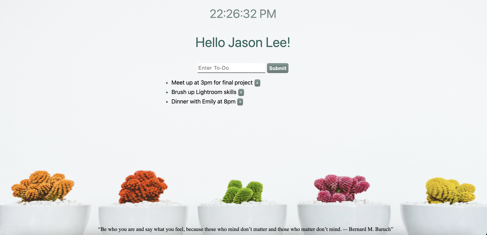

# To-Do List :smiley:

### Link: https://jasonlee-cp.github.io/To-Do/

The To-Do list is built with html, css, and vanila javascript.

Features

* add/delete tasks
* Display the current time
* Randomly generate motivational quotes.

-> Clone the repository and save it to your local location so that you can use the attached images.

